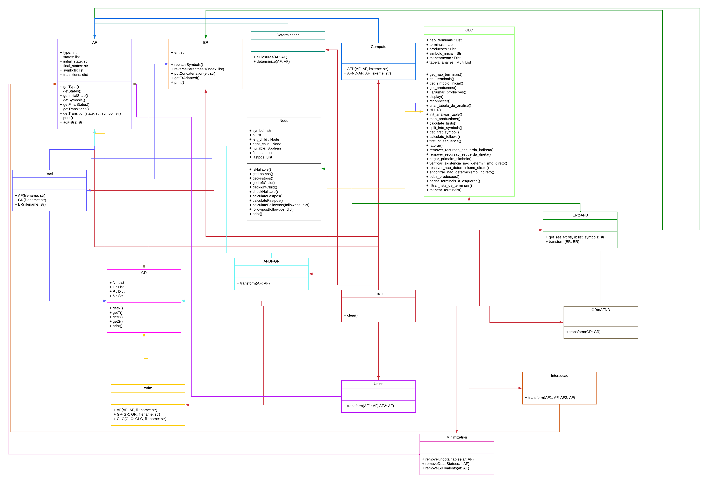

<p align="center">

</p>

<h1 align="center">
UNIVERSIDADE FEDERAL DE SANTA CATARINA<br />
CENTRO TECNOLÓGICO<br />
CURSO DE GRADUAÇÃO EM CIÊNCIAS DA COMPUTAÇÃO
</h1>
</br>
</br>
</br>
<h3 align="center">
  Gabriel Dutra, Bruno da Silva Castilho e Rafael Begnini de Castilhos
</h3>
</br>
</br>
<p align="center">
  28 de Junho de 2023
</p>
</br>


# Trabalho: Manipulação de Linguagens Regulares e Linguagens Livres de Contexto
1. Objetivo do Trabalho:
O objetivo deste trabalho é a implementação dos algoritmos relacionados à manipulação
de Linguagens Regulares e Livres de Contexto. Tais algoritmos são úteis na implementação de Geradores de Analisadores Léxicos e Sintáticos ou na implementação dos próprios
analisadores, servindo de arcabouço para o desenvolvimento de Compiladores.

2. Definição do Trabalho:\
Implementar algoritmos para manipular Autômatos Finitos, Gramáticas Regulares, Expressões Regulares, Gramáticas Livres de Contexto e Autômatos de Pilha.

Os seguintes algoritmos devem ser implementados:
  - Conversão de AFND (com e sem ε) para AFD
  - Conversão de AFD para GR e de GR para AFND
  - Minimização de AFD
  - União e interseção de AFD
  - Conversão de ER para AFD (usando o algoritmo baseado em árvore sintática - Livro
  Aho - seção 3.9)
  - Reconhecimento de sentenças em AF
  - Reconhecimento de sentenças em AP (via implementação de uma tabela Preditivo
  LL(1)) - Além dos algoritmos relacionados a análise da sentença de entrada, devem
  ser implementados os algoritmos para cálculo dos conjuntos First e Follow, Fatoração e Eliminação de Recursão à esquerda 


## Dependências
  - Projeto desenvolvido na linguagem de programação python, para a instalação do interpretador execute o seguinte comando:
    ```
    apt-get install python3
    ```
  - Neste projeto foi utilizado a biblioteca pandas, para instalação siga os passos abaixo:
    1. Instale o gerenciador de pacotes do python.
       ```
       apt-get install python3-pip
       ```
    2. Instale a biblioteca pandas.
        ```
        pip3 install pandas
        ```

# Estrutura de dados
  - As estruturas utilizadas para o funcionamento do projeto foram separadas no diretório "structures", elas são explicadas a seguir:
    - AF, uma classe na qual representa automatos finitos, no qual posui atributos de estados, estado inicial, estado final, tipo (AFD ou AFND), simbolos e transições.
    - ER, uma classe representando expressões regulares, o único atributo dela é "er", no qual é uma string que representa a expressão.
    - GLC, uma classe que representa gramáticas livres de contexto, possuindo atributos como nao terminais, terminais, producoes, simbolo inicial, mapeamento e tabela de análise.
    - GR, uma classe na qual representa gramáticas regulares, seus atibutos são separados em uma lista de não terminais, uma lista de terminais, um dicionário que mapeia produções de cada não terminal e um símbolo inicial da gramática.
    - Node, uma classe que representa um node utilizado principalmente formação da árvore de derivação.
  - Para facilitar o entendimento, alguns atributos serão descritos a seguir:

    ## AF

      ```
      Tipo: {
      ‘0’ - AFD
      ‘1’ - AFND
      }
      ```
      O tipo de um autômato finito pode variar, e a forma como cada um é tratado e as funções que o acompanham são distintas, logo ocorreu a separação em "type" = 0 para deterministico e  "type" = 1 para não deterministico.
      ```
      Transições: {
      ‘estado’: {‘simbolo’:’estado’}
      }
      ```
      Para todos os estados, cria-se uma chave em um dicionário que aponta para outro dicionário contendo chaves para todos os simbolos do automato, apontando para o estado alcançado pela transição, no caso de não determinísticos uma lista de estados não alcançados. Estados mortos em AFD são representados por None e nos AFND como uma lista vazia.
    
    ## GLC
    
     ```
    Produções: {
	  ['P->KVC', 'K->cK', 'K->&', 'V->vV', 'V->F', 'F->fP;F', 'F->&', 'C->bVCe', 'C->d;C', 'C->&']
    }
    ```
    As produções são armazenadas como strings em uma lista, na qual o início é a cabeça de pordução, logo após é o símbolo "->", então uma formação da cabeça.  
    ```
    Tabela de Análise: {
	‘Tabela de análise’[‘Não Terminal’][‘Terminal’] = ‘Valor’
    }
    ```
    A tabela de análise é um dicionário, criado para realizar análises referentes ao comportamento de não terminais com terminais, logo para cada relacionamento é atribuido um valor, então usada para avaliar sentenças.
    
    ## GR
    ```
    Produções: {
	  ‘Cabeça de produção’: [{‘n’, ‘t’}]
    }
    ```
    Para todas as cabeças de produção, cria-se uma chave em um dicionario que aponta para uma lista, contendo dicionários para cada produção, com duas chaves ‘n’ que aponta para o não terminal da produção,  e ‘t’ que aponta para o terminal. Caso a produção seja apenas um terminal, o dicionario tera apenas a chave ‘t’ apontando para o mesmo.

    
## Modelagem
  - Para a modelegem foi feito um diagrama.



## Tipos de arquivos de entrada
  - Gramáticas Regulares
    - Descreva a GR em um arquivo `.txt`, da seguinte forma:
      1. Linha-1 - símbolos não terminais separados por `,`, exemplo: `A,B,C`
      2. Linha-2 - símbolos terminais separados por `,`, exemplo: `a,b,c`
      3. Linha-3 - símbolo inicial da gramática, exemplo `A`
      4. Linha-4aN - Descreva as produções da seguinte forma `{cabeça de produção}-> prod1 | prod2`, exemplo: `A-> aA | bB | cC| a`
    - Exemplo de arquivo:
      ```txt
      A,B,C
      a,b,c
      A
      A-> aA | bB | cC| a 
      B-> bB | cC | b 
      C-> cC | c
      ```
  - Autômatos Finito
    - Descreva o autômato em um arquivo `.txt`, da seguinte forma:
      1. Linha-1 - Tipo do autômato, `0 para AFD e 1 para AFND`
      2. Linha-2 - Estado inicial do autômato, exemplo: `q0`
      3. Linha-3 - Todos os estados de aceitação do autômato separados por `,`, exemplo: `q1,q2`
      4. Linha-4 - Todos o simbolos reconhecidos pelo autômato separados por `,`, exemplo: `a,b,c`
      5. Linha-5 - Todos os estados do autômato separados por `,`, exemplo: `q0,q1,q2`
      6. Linha-6aN - Transições do autômato, exemplo: `q0,a,q1` ou `q0,a,q1-q2`
    - Exemplos de arquivo:
      ```txt
      0
      q0
      q1,q2
      a,b,c
      q0,q1,q2
      q0,a,q1
      q0,b,q2
      q1,a,q1
      q1,b,q0
      q2,a,q0
      q2,b,q2
      ```
      ```txt
      1
      q0
      q1,q2
      a,b,c
      q0,q1,q2
      q0,a,q1-q2
      q0,b,q1-q2
      q1,a,q1
      q1,b,q0
      q2,a,q0
      q2,b,q2
      ```
- Expressões Regulares
  - Escreva a ER em um arquivo ```.txt```, com os seguintes critérios.
    1. A Expressão deve conter apenas os operadores `*,+,|,?`
    2. A Expressão deve estar contida na primeira linha do arquivo.
  - Exemplo de arquivo:
    ```txt
    (a|b)*(ab)?(ab)(&|a)+
    ```

- Gramáticas Livre de Contexto
    - Descreva a GR em um arquivo `.txt`, da seguinte forma:        
      1. Linha-1 - Definição da gramática, `*GLC`
      2. Linha-2 - Definição de não terminais: `*NaoTerminais`
      3. Linha-3 - Todos os não terminais separados por ` ` (espaço em branco), exemplo: `P K V`
      4. Linha-4 - Definição de terminais: `*Terminais`
      5. Linha-5 - Todos os terminais separados por ` ` (espaço em branco), exemplo: `c v f`
      6. Linha-6 - Definição de simbolo inicial: `*SimboloInicial`
      7. Linha-7 - Simbolo inicial, exemplo: `P`
      8. Linha-8 - Definição de produções: `*Producoes`
      9. Linha-9aN - Todas as produções, uma por linha: `P->KVC`
    - Exemplos de arquivo:
      ```txt
        *GLC
        *NaoTerminais
        P K V F C
        *Terminais
        c v f ; b e d
        *SimboloInicial
        P
        *Producoes
        P->KVC
        K->cK
        K->&
        V->vV
        V->F
        F->fP;F
        F->&
        C->bVCe
        C->d;C
        C->&
      ```
## Execução
  - Inputs
    - Os arquivos de entrada devem estar contidos no diretório `./data`.
  
  - Outputs
    - Os arquivos de saída irão ser alocados no diretório `./data`.
   
  - Run
    - Para iniciar a aplicação execute um dos comandos abaixo, e siga as instruções que aparecerão.
      ```
      python3 main.py
      ```
      ou
      ```
      python main.py
      ```
